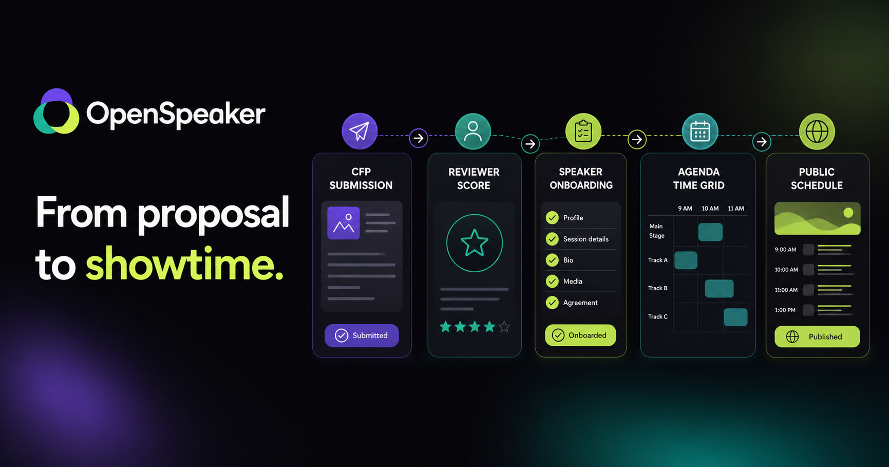
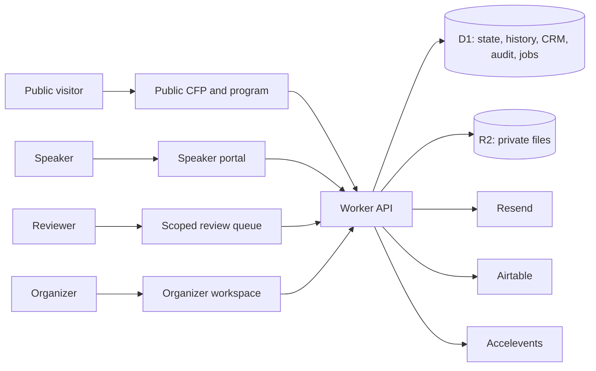

<div align="center">

# OpenSpeaker

### From proposal to published program.

OpenSpeaker is an open-source conference program operations platform for collecting proposals, running committee review, onboarding speakers, building a conflict-aware agenda, communicating with participants, and publishing a mobile-ready attendee experience.

[**Open the live application**](https://openspeaker-kms.premhiru.chatgpt.site) · [**Read the documentation**](https://openspeaker-kms.premhiru.chatgpt.site/#/docs) · [Quickstart](docs/quickstart.md) · [API reference](docs/api-reference.md) · [Deployment guide](docs/deployment.md)

[](https://github.com/premhiru/KMS/actions/workflows/ci.yml)


[](LICENSE)

</div>



## Why OpenSpeaker

Conference programs usually move through disconnected forms, spreadsheets, email threads, file drives, review tools, and website updates. OpenSpeaker keeps that lifecycle in one shared, revisioned workspace:

```text
Publish CFP → Collect proposals → Review and decide → Onboard speakers
     → Schedule sessions → Send invitations and reminders → Publish program
```

The product deliberately focuses on program operations rather than ticketing, marketing automation, payments, or a general-purpose CMS.

## What is included

| Area | What OpenSpeaker provides |
|---|---|
| **Call for proposals** | Custom questions, required fields, conditional logic, category routing, tracks and formats, co-speakers, close dates, submission limits, thank-you content, validation, throttling, and anonymous persistence. |
| **Proposal access** | Enumeration-safe email links let anonymous applicants return to their own proposal dashboard without receiving workspace membership. |
| **Evaluation** | Multi-round plans, typed and weighted rubrics, blind review, email-scoped assignments, notes, abstention, progress, advancement, aggregate results, decisions, and CSV export. |
| **Speaker operations** | Event roster, invitations, profiles, social and travel fields, sessions, onboarding tasks, document requests, approval status, and organizer progress views. |
| **Speaker portal** | Self-service proposal status, invitation response, profile editing, tasks, headshots, slides, supporting documents, immutable file versions, comments, sessions, and approved wiki resources. |
| **Deliverables** | Cross-speaker task matrix, due and approval filters, file metadata, version history, comments, reminder queueing, downloads, and ZIP export. |
| **Agenda** | Multi-day drag and drop, manual and invited sessions, auto-scheduling, room/speaker/track/availability conflicts, publish gates, and list/day/week/track/room views. |
| **Communications** | Reusable templates, merge fields, audiences, recipient previews, Resend delivery, durable logs, automated reminders, and recipient-scoped RFC 5545 calendar invitations. |
| **Public experience** | Sessions list, speakers list, agenda, personal itinerary, speaker gallery, details, search, filters, responsive layouts, iframe widgets, and calendar export. |
| **Public feeds** | Native JSON, XML, and iCalendar endpoints with filters, privacy projection, CORS, caching, ETags, `HEAD`, and `304` support. |
| **Cross-event CRM** | Workspace contact directory, CSV import and deduplication, tags, custom fields, notes, activity, segments, pipeline, outreach previews, event links, and add-to-event handoff. |
| **Integrations** | One-way Airtable CRM mirror, native one-way Accelevents program sync, provider status, idempotency, leases, retries, and durable run history. |
| **Operations** | Role-based access, tenant isolation, optimistic concurrency, state history and rollback, audit records, retention jobs, health reporting, and portable exports. |

## Product surfaces

| Route | Audience | Purpose |
|---|---|---|
| `#/dashboard` | Organizer | Program health, outstanding onboarding, approvals, and deadlines |
| `#/cfp-builder` | Organizer | CFP settings, questions, conditions, routing, and publication |
| `#/cfp` | Public | Anonymous proposal submission and secure proposal access |
| `#/submissions` | Organizer | Proposal editing, status, decisions, import/export, and deletion |
| `#/reviews` | Organizer / reviewer | Evaluation plans, assignments, rubrics, scoring, and advancement |
| `#/speakers` | Organizer | Speaker directory, profiles, tasks, sessions, and files |
| `#/deliverables` | Organizer | All speaker tasks, versions, comments, reminders, and ZIP export |
| `#/agenda` | Organizer | Schedule builder, conflicts, publication, ICS, and Accelevents sync |
| `#/communications` | Organizer | Templates, personalized delivery, reminders, logs, and calendar invites |
| `#/crm` | Organizer | Cross-event contacts, segments, pipeline, campaigns, and Airtable sync |
| `#/embeds` | Organizer | Saved public widget definitions, previews, code, and native feeds |
| `#/portal` | Speaker | Proposals, profile, sessions, onboarding, files, and resources |
| `#/event/sessions` | Public | Mobile-friendly published program and personal itinerary |
| `#/docs` | Everyone | Interactive setup, architecture, API, provider, and deployment guides |

## How it works



The same typed event model drives every role. The Worker applies a different server-side projection for organizers, reviewers, speakers, and anonymous visitors; hiding a control in React is never treated as an authorization boundary.

### Persistence model

- **D1 is authoritative in production.** It stores memberships, revisioned event state, normalized public submissions, audit history, CRM records, provider runs, reminder jobs, and rate limits.
- **R2 stores private file bytes.** D1 stores ownership, type, size, task references, approvals, and immutable deliverable versions.
- **Writes are optimistic.** Clients provide an expected revision and receive `409 REVISION_CONFLICT` when another actor saved first.
- **History is durable.** Every organizer state change creates a snapshot; rollback restores an older snapshot as a new revision rather than deleting history.
- **Local development is intentionally different.** It uses seeded, versioned browser storage so the entire product can be explored without cloud credentials.

## Quickstart

### Requirements

- Node.js 20 or newer
- npm 10 or newer
- Git

### Install and run

```bash
git clone https://github.com/premhiru/KMS.git
cd KMS
npm ci
npm run dev
```

Open [http://localhost:5173](http://localhost:5173).

No database or provider credentials are required for the local preview. It includes seeded speakers, proposals, review plans, tasks, sessions, templates, CRM contacts, and public content.

### Try the complete workflow

1. Configure and publish the CFP in `#/cfp-builder`.
2. Submit a proposal anonymously at `#/cfp`.
3. Create review rounds and assignments in `#/reviews`.
4. Accept a proposal and inspect the generated onboarding work.
5. Update the speaker profile and files in `#/portal`.
6. Schedule the accepted session and resolve conflicts in `#/agenda`.
7. Publish, then browse `#/event/sessions` and export an itinerary.

## API examples

OpenSpeaker exposes public read/write routes and identity-scoped workspace routes. Responses use either `{ "data": ... }` or `{ "error": { "code", "message", "details?", "requestId" } }`.

### Submit a proposal

```bash
curl -X POST \
  https://your-domain.example/api/public/cfp/workspace-demo/devflow-2027 \
  -H "Content-Type: application/json" \
  -d '{
    "title": "Reliable agents in production",
    "abstract": "Patterns for observable and recoverable agent systems.",
    "speakerName": "Maya Chen",
    "speakerEmail": "maya@example.com",
    "track": "AI Engineering",
    "format": "Talk",
    "consent": true,
    "customAnswers": { "experience": "Advanced" }
  }'
```

The server—not the browser—enforces CFP dates, limits, valid tracks/formats, enabled routing rules, visible required questions, conditional dependencies, and rate limits.

### Subscribe to the published program

```bash
curl "https://your-domain.example/api/public/events/workspace-demo/devflow-2027/feeds/program.json?track=AI%20Engineering"
curl "https://your-domain.example/api/public/events/workspace-demo/devflow-2027/feeds/program.xml"
curl "https://your-domain.example/api/public/events/workspace-demo/devflow-2027/feeds/program.ics"
```

Feeds include accepted proposals attached to published sessions and confirmed public speakers only. Reviewer notes, emails, tasks, CRM data, and source payloads are excluded.

### Update revisioned state

```bash
curl -X PUT \
  https://your-domain.example/api/workspaces/workspace-demo/events/event-devflow/state \
  -H "Content-Type: application/json" \
  -H 'If-Match: "42"' \
  -d '{
    "expectedRevision": 42,
    "event": {
      "name": "DevFlow 2027",
      "slug": "devflow-2027",
      "cfpOpen": true,
      "cfpConfig": {}
    },
    "state": { "schemaVersion": 1 }
  }'
```

The abbreviated state above illustrates the concurrency envelope; a real write supplies the complete validated `AppState` document. See the [API reference](docs/api-reference.md) and [canonical Worker contract](db/api-contract.md) for full request and response shapes.

## Authentication and authorization

Production identity comes from trusted hosting headers. The application does not accept browser-manufactured identity headers.

| Role | Server-enforced scope |
|---|---|
| **Owner** | Workspace bootstrap, membership, audit, rollback, and every organizer action |
| **Organizer** | Event setup, proposals, reviews, speakers, files, agenda, messaging, CRM, and integrations |
| **Reviewer** | Only their assigned submissions and open evaluation rounds; blind plans redact identity data |
| **Speaker** | Only their own profile, proposals, tasks, files, sessions, and approved resources |
| **CFP claimant** | One event and one matching speaker/proposal projection through a short-lived, path-scoped cookie |
| **Public** | Anonymous CFP configuration and the sanitized published program only |

Anonymous applicants may request a one-time email link. The raw token is never stored; redemption creates a hashed, event-scoped session that does not grant workspace membership or access to organizer, reviewer, audit, CRM, asset-administration, or integration routes.

For hands-off evaluations, an owner can open **Access & audit → Members** and generate up to ten one-time evaluator organizer links. Each evaluator signs in with their own ChatGPT identity, the link binds that verified identity automatically, and access expires after the owner-selected period. The raw links are displayed once, are never stored in plaintext, and must be shared privately rather than committed to the repository.

## Production deployment

OpenSpeaker builds a React client and a Cloudflare-compatible Worker package.

```bash
npm ci
npm run build
```

The Sites manifest declares the logical storage bindings:

```json
{
  "project_id": "your-sites-project-id",
  "d1": "DB",
  "r2": "FILES"
}
```

### Runtime configuration

| Capability | Variables | Required? |
|---|---|---|
| Storage | `DB`, `FILES` bindings | Yes |
| Initial owner | `BOOTSTRAP_OWNER_EMAIL` | Yes for a new production workspace |
| Trusted browser origins | `ALLOWED_ORIGINS` | Recommended |
| Email, proposal links, reminders, calendar invitations | `RESEND_API_KEY`, `EMAIL_FROM` | Optional |
| Accelevents one-way sync | `ACCELEVENTS_API_KEY`, `ACCELEVENTS_EVENT_URL` | Optional |
| Airtable CRM mirror | `AIRTABLE_TOKEN`, `AIRTABLE_BASE_ID`, `AIRTABLE_TABLE_NAME` | Optional |
| Maintenance fallback | `CRON_SECRET` | Optional |
| Provider timeout and leases | `PROVIDER_TIMEOUT_MS`, `INTEGRATION_LEASE_MS`, `AUTOMATION_LEASE_SECONDS` | Optional |
| CFP and file limits | `CFP_RATE_LIMIT`, `MAX_ASSET_BYTES`, event/user quota variables | Optional |
| Retention | `CFP_RETENTION_DAYS`, `AUDIT_RETENTION_DAYS`, integration/automation/rate-limit variables | Optional |

> [!IMPORTANT]
> Provider values belong in hosted secrets. Never put Resend, Airtable, Accelevents, cron, or identity credentials in source files, commits, issues, examples, screenshots, or client-side environment variables.

The UI reports integration status honestly. Core program workflows, local outbox, exports, and calendar downloads remain available without optional providers; external delivery and sync actions remain disabled until configured.

### Resend and calendar invitations

With `RESEND_API_KEY` and `EMAIL_FROM`, OpenSpeaker can deliver:

- proposal confirmations and secure proposal-access links;
- personalized acceptance and onboarding messages;
- due-date reminders from the scheduled or authenticated maintenance runner;
- server-generated, recipient-scoped `METHOD:REQUEST` calendar invitations with stable UIDs and sequence updates.

Client-supplied calendar bytes are discarded. The Worker regenerates invitations from persisted, published session data.

### Airtable CRM mirror

D1 remains the CRM source of truth. Airtable is an optional, one-way operational mirror of safe contact fields.

The default table is `Speaker CRM Contacts` and expects these case-sensitive fields:

| Airtable field | Suggested type |
|---|---|
| `OpenSpeaker Contact ID` | Primary single-line text |
| `First Name`, `Last Name`, `Email`, `Company`, `Job Title` | Single-line text |
| `Biography`, `Travel Preferences`, `Custom Fields JSON`, `Event Links JSON` | Long text |
| `LinkedIn URL`, `Twitter URL` | URL |
| `Tags` | Long text or multiple select |
| `Updated At` | Date/time |

Internal notes, pipeline rationale, campaign previews, activity history, audit records, and tokens never leave D1. Sync uses durable runs, idempotency keys, local-to-remote mappings, and reconciliation before creating records.

### Accelevents

The native adapter sends confirmed speakers and accepted, published sessions one way to the configured Accelevents event. It creates or updates speakers before sessions, retains remote object mappings, and exposes replayable run/error history. OpenSpeaker never imports remote changes back into D1.

See [Production deployment](docs/deployment.md) for the release checklist and [Operations](db/operations.md) for backup, restore, retention, and monitoring.

## Public widgets and feeds

Organizers can save named widget definitions for:

- sessions list;
- speakers list;
- agenda;
- personal itinerary;
- speaker gallery.

Definitions include enabled state, output format, colors, filters, visible fields, size, and embed code. Styled HTML renders as a responsive iframe; JSON, XML, and iCalendar selections resolve to native MIME endpoints rather than a simulated client view.

Public feed endpoints support exact `track`, `format`, and `room` query filters, `Access-Control-Allow-Origin: *`, five-minute caching with stale revalidation, revision-derived ETags, `HEAD`, and `304 Not Modified`.

## Reliability and security

- Tenant and event scope is applied to every private database and file operation.
- Reviewer and speaker projections are built on the server.
- Mutations validate trusted origins and complete domain invariants.
- Public CFP endpoints apply IP/email/event rate limits and bounded submissions.
- File uploads enforce size quotas, MIME allowlists, and content/signature checks.
- Provider calls use timeouts, durable logs, renewable leases, and idempotency keys.
- Public state excludes email, review, task, CRM, audit, and source-submission data.
- The organizer client rebases compatible concurrent edits and fails closed on hydration errors.
- State history supports attributed inspection and rollback-as-a-new-revision.

For threat boundaries and request flow, read [Architecture](docs/architecture.md).

## Testing

```bash
npm test
npm run lint
npm run build
npx playwright install chromium
npm run test:e2e
npm audit --omit=dev
```

The automated release gate covers:

- domain rules, reducers, selectors, evaluation rounds, calendar output, exports, and reconciliation;
- API validation, authentication, tenant/RBAC isolation, D1/R2 lifecycles, revision conflicts, history, rollback, rate limits, claims, reminders, and provider idempotency;
- organizer, reviewer, speaker, anonymous CFP, CRM, public widget, native feed, mobile, accessibility, keyboard, focus, failure, and concurrency workflows in Chromium.

CI runs on every branch push and pull request through [`.github/workflows/ci.yml`](.github/workflows/ci.yml).

## Repository map

```text
src/
  core/          Application provider, reconciliation, selectors, exports
  domain/        Typed product model, seed data, rules, reducer contracts
  features/      Organizer, reviewer, speaker, CRM, embeds, docs, and public UI
  services/      Typed Worker API client and response validation
worker/          Cloudflare-compatible API, authorization, jobs, integrations
drizzle/         Versioned D1 migrations
db/              API, schema, and operations contracts
docs/            Task-oriented setup, architecture, API, and deployment guides
tests/e2e/       Playwright release and responsive workflow coverage
```

## Documentation

- [Live interactive documentation](https://openspeaker-kms.premhiru.chatgpt.site/#/docs)
- [Quickstart](docs/quickstart.md)
- [Architecture and trust boundaries](docs/architecture.md)
- [API reference and examples](docs/api-reference.md)
- [Production deployment](docs/deployment.md)
- [Canonical Worker API contract](db/api-contract.md)
- [Database schema](db/schema.md)
- [Operations, backup, retention, and monitoring](db/operations.md)

## Design principles

1. Speakers should always know their next action.
2. Organizers should not need a parallel spreadsheet.
3. Human reviewers own decisions; automation supports rather than replaces judgment.
4. Public schedules and profiles should be fast, accessible, and mobile-first.
5. Private data should be projected by the server, not merely hidden by the client.
6. Event data should remain portable, revisioned, and integration-friendly.

## Contributing

Issues and pull requests are welcome. Before opening a change:

1. keep domain changes typed and migration-safe;
2. preserve role and tenant boundaries in the Worker;
3. add focused tests for new behavior;
4. run the complete verification commands above;
5. never include real provider credentials or participant data.

## License

[MIT](LICENSE) © 2026 OpenSpeaker contributors
